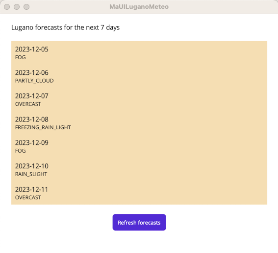

# MaUILuganoMeteo

This is a sample for a #.NET MAUI# frameork app.

<p float="center">
  
  
</p>

## Modules

```
Model   
│
└─── Forecast.cs
│
Platforms
│
└─── Android - specific Android build files
│
└─── iOS - specific iOS build files
│
└─── MacCatalyst - specific MacCatalyst build files
│
└─── Tizen - specific Tizen build files
│
└─── Windows - specific Windows build files
│
Resources
│
Services
│
└─── IForecastService.cs - ForecastService.cs
│
ViewModels
│
└─── ForecastViewModel.cs
Views
│
└─── MainPage.xaml - MainPage.xaml.cs
│
App.xaml - App.xaml.cs
│
MauiProgram.cs
```


